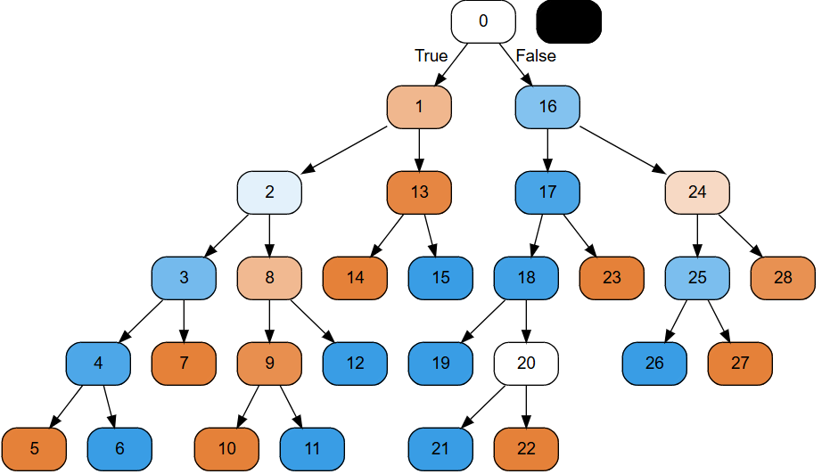

# 1. Tox21 화학 물질 독성 예측 프로젝트

> 이 프로젝트는 화학 물질의 독성 반응(Tox21) 데이터셋을 가지고, **'독성' 여부를 예측하는 모델을 만들어 본 과정**을 **기록**한 것입니다.
>
> 단순히 모델을 돌린 것이 아니라, **'데이터가 왜 이렇지?'**라고 분석하고, **1차 모델의 실패 원인을 파악**하여 **모델을 개선**하는 과정에 집중했습니다.

---

## 📂 프로젝트 구조

* **`Tox21_Tutorial.ipynb`**: 데이터 전처리, 모델링, 해석의 전체 과정이 담긴 주피터 노트북 (이 프로젝트의 본체)
* **`tox21.csv.gz`**: 원본 데이터셋
* **`tree.png`**: 
---

## 🎯 1. 처음 마주한 문제: 결측치와 극심한 불균형

데이터를 처음 열어보니 `df.info()`와 `df.describe()`에서 바로 두 가지 큰 문제가 보였습니다.

1.  **엄청난 결측치 (Missing Data):** 7,831개의 데이터 중 12개의 독성 타겟 컬럼 모두에 상당수의 결측치(NaN)가 존재했습니다.
2.  **극심한 데이터 불균형 (Imbalance):** `NR-AR` 컬럼을 예로 들면, 결측치를 제외한 3,079개의 데이터 중 비독성(0)이 3,020개인 반면, **독성(1)은 단 59개(약 1.9%)**에 불과했습니다.

---

## 🛠 2. 나의 분석 전략: '단순화'와 '특성 공학'

12개 타겟을 다 하는 대신, 이 문제들을 해결하는 '방법론'을 만드는 게 중요하다고 생각했습니다. 그래서 `NR-AR`을 대표로 골랐습니다.

### 1단계: 데이터 정제
* **결측치 처리:** `dropna()`로 결측치가 있는 행은 모두 제거했습니다. 데이터가 3,079개로 줄었지만, 확실한 데이터로 시작하고 싶었습니다.
* **불균형 해결:** 1.9%라는 극심한 불균형을 해결하기 위해, 다수 클래스(0)를 소수 클래스(1)에 맞추는 **언더샘플링(Undersampling)**을 진행했습니다. 독성(1) 59개에 맞춰 비독성(0) 59개를 무작위로 추출해, 50:50 비율의 데이터셋(총 118개)을 만들었습니다.

### 2단계: 특성 공학 (Feat. RDKit)
모델은 `smiles`라는 화학 구조 문자열을 이해하지 못합니다. **제 화학 전공 지식**을 활용해, **`RDKit`**이라는 화학정보학 라이브러리로 이 문자열을 217개의 **숫자(분자 디스크립터)**로 변환했습니다.

* **(Before)** `smiles` (문자열) ➡️ **(After)** `MaxAbsEStateIndex`, `HeavyAtomMolWt` 등 217개의 숫자형 특성(Feature)

---

## 🧠 3. 모델링: 1차 실패와 2차 개선

### 1차 시도: 로지스틱 회귀 (실패)
가장 기본적이고 해석이 쉬운 **로지스틱 회귀** 모델을 먼저 돌려봤습니다.
* **결과:** **정확도 50%**
* **분석:** 혼돈 행렬 `[[0, 12], [0, 12]]`을 확인했습니다. 이건 **완전한 실패**였습니다. 모델이 비독성(0)은 아예 맞히지 못하고, **모든 샘플을 '독성(1)'이라고 찍어버린 것**입니다.
* **판단:** 이 결과를 통해 **"이 데이터는 단순한 선형 모델로는 풀 수 없겠구나"**라고 판단했습니다.

### 2차 시도: 결정 트리 (개선)
1차 모델이 선형 패턴을 못 찾았으니, **비선형(Non-linear) 패턴을 학습할 수 있는 결정 트리(Decision Tree) 모델**로 2차 시도를 했습니다.
* **결과:** **정확도 67%**
* **분석:** `classification_report`를 보니, 50%에서 67%로 유의미하게 상승했을 뿐만 아니라, 이번엔 두 클래스(0, 1)를 모두 **균형 있게 예측**하는 것을 확인했습니다.

---

## 💡 4. 결론: "모델은 무엇을 보았는가?"

67%가 높은 점수는 아니지만, 50%(찍기)에서 벗어나 **모델이 '무언가'를 학습했다**는 것이 중요했습니다. 결정 트리의 가장 큰 장점은 그 **'무언가'를 눈으로 볼 수 있다**는 것입니다.

`export_graphviz`로 트리를 시각화해보니, 모델이 다음과 같은 **화학적 특성**을 기준으로 독성을 판단하는 것을 확인했습니다.

* **`HeavyAtomMolWt` (중원자 분자량)**
* **`BCUT2D_LOGPHI`**
* **`VSA_EState8`** 등

이는 **RDKit으로 만든 분자 디스크립터가 유의미**했다는 증거이며, 이 데이터를 가지고 더 복잡한 모델(앙상블 등)을 시도해 볼 가치가 있음을 보여줍니다.

### 향후 개선 방향
* 이번엔 언더샘플링으로 데이터를 너무 많이 버렸습니다. 다음에는 `SMOTE` 같은 **오버샘플링**으로 데이터 양을 확보하겠습니다.
* `RandomForest`나 `XGBoost` 같은 더 강력한 모델을 사용해 67%의 정확도를 더 높여볼 계획입니다.
